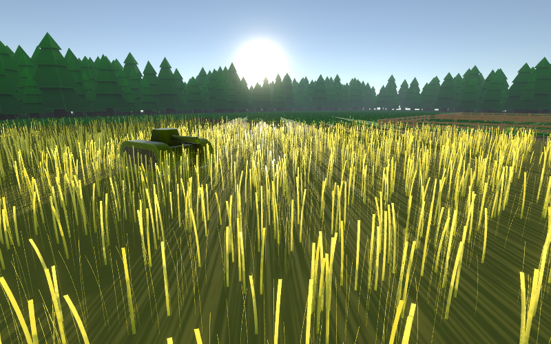
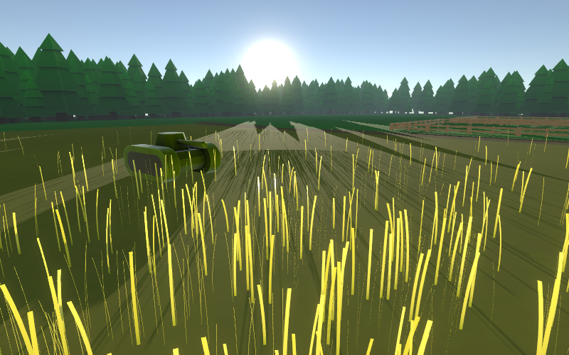
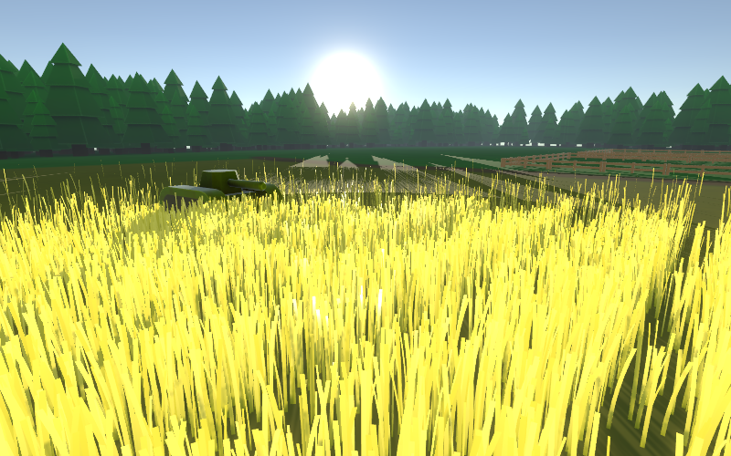
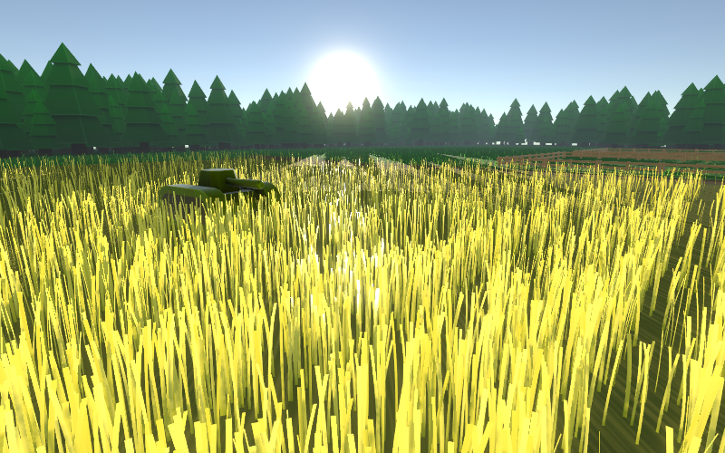
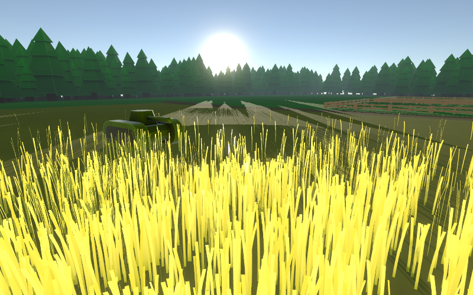

# Performance Settings

The following settings do not cause a recompile of the shader, unlike [shader variants](shader-variants.md), but they still have an extreme performance impact.

## **Density Settings**

The 4 density settings are the single most important settings in regards to performance and visual appearance.

* **Target Density**: This setting represents the maximum density of your grass. You should use the highest value where the material still looks good, in order to improve performance.
* **Density Falloff Start**: The distance after which grass density will start to decrease. Everything between the camera and this distance will have exactly the **Target Density**.
* **Density Falloff Scale**: Scales the falloff speed linearly. A higher value causes the density to decrease more quickly.
* **Density Falloff Power**: Scales the falloff speed non-linearly. A higher value increases the speed at which density increases.


The density falloff scales like this: $$(s d)^p$$, where $$s$$ is the scale, $$d$$ is the distance from the falloff start, and $$p$$ is the falloff power.



Don't use **Target Density** like an arbitrary slider. It should represent a specific maximum density. You should use a mesh with sufficient polygon density (or use mesh normalization on the mesh filter) and select a value that represents the density you want for your scene. When you follow this rule, you will prevent artifacts, make the material more predictable, and improve your visual appearance.




<figure><figcaption></figcaption></figure>



<figure><figcaption></figcaption></figure>





<figure><figcaption></figcaption></figure>



<figure><figcaption></figcaption></figure>





<figure><figcaption></figcaption></figure>



<figure><figcaption></figcaption></figure>





<figure><figcaption></figcaption></figure>



<figure><figcaption></figcaption></figure>



## **LOD Settings**

These settings change how many polygons are used per blade of grass. This can be used to improve performance.

## **Fade Settings**

These settings define at which distance the grass starts to fade into the ground. All blades of grass further away than **Grass Fade End** will not be rendered at all, which improves performance.
