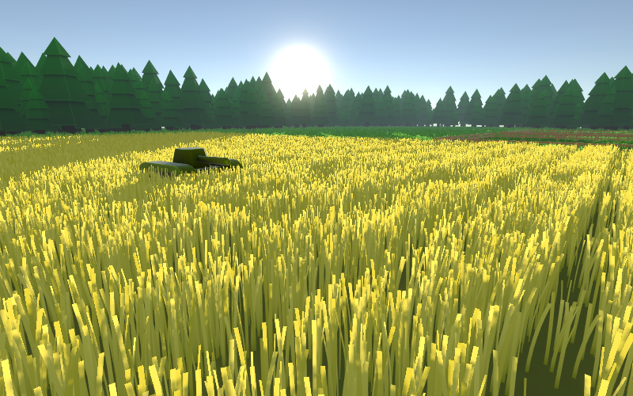
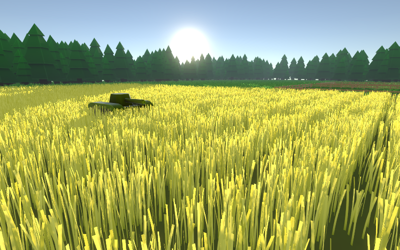
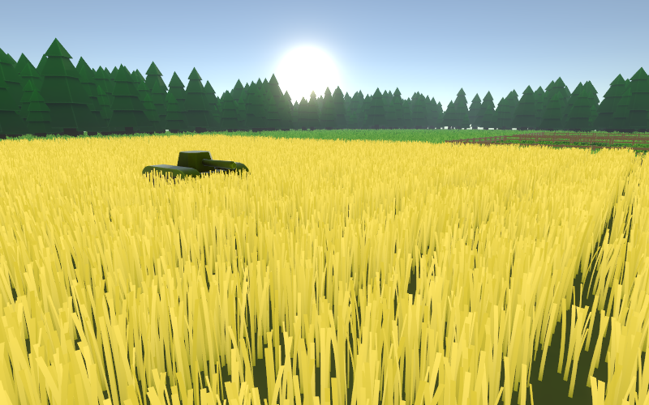
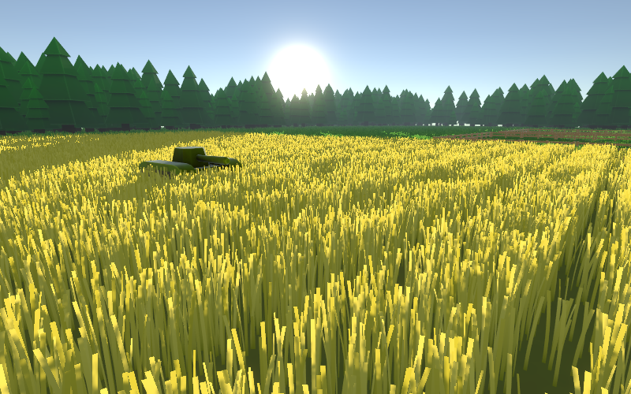
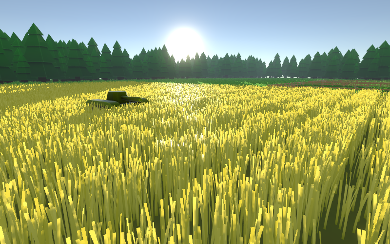
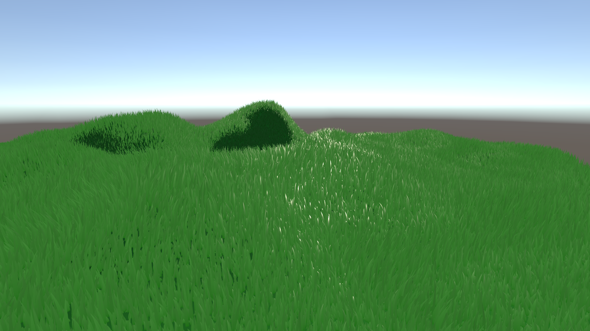
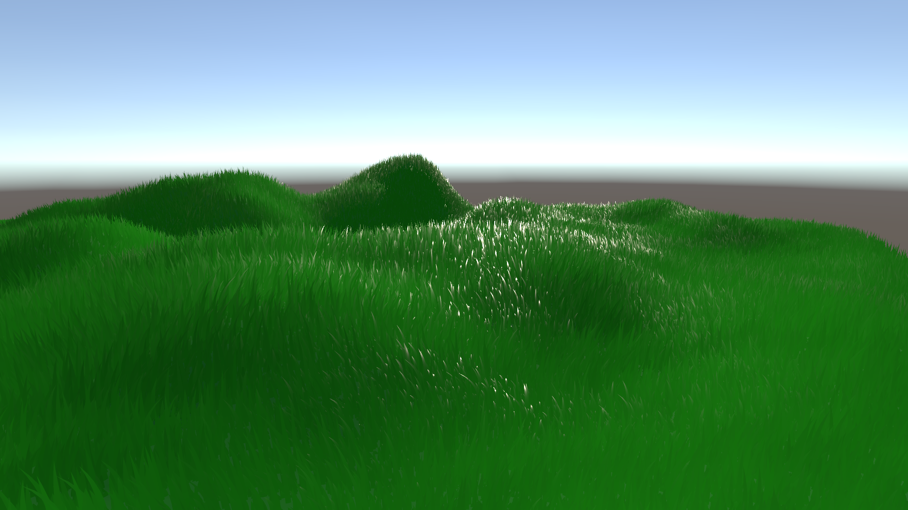
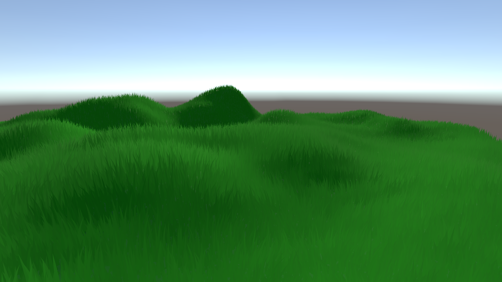

# Shader Variants

Shader variants make it possible to change the shader code from within the editor, which allows for very different behavior, without having to use costly branching in the shader itself. Changing one of these settings causes the editor to recompile the shader and can increase the build time immensely.

With shader variants, it is possible to have one large shader that is very customizable, without sacrificing any performance. More info about shader variants can be found in the [Unity documentation](http://docs.unity3d.com/Manual/SL-MultipleProgramVariants.html).

If you are using more than one very complex shader, Unity might encounter errors because there are too many shader keywords. It can also cause extreme compile times, as Unity is trying to compile all combinations of shader variants. More about these in the Performance Optimization section.

## Grass Modes

### **Grass Types**

This setting is the most important for the visual appearance of the grass material. It can also have a high-performance impact. In short: "Simple" is the cheapest and "4 Textures" is the most expensive shader version.

* **Simple Grass**: In this mode, the shader generates simple, textureless blades of grass. This mode is ideal for large areas with high view distance and fits perfectly into stylized games.
* **1 - 4 textures**: This mode allows you to have up to 4 different textures. You can set their density either by using absolute values, textures, or vertex colors, each channel controls one grass type.

### **Density Mode**

The density modes can be used to add variation, so the grass is not equally distributed over your mesh, and to set areas for different grass types. You could for example have a field of wheat right next to a field of grass with occasional patches of grass using a single material.


You should never use the density modes to reduce the density of the whole material, for example having a density value of 0.5. This would cost performance, without any benefit. Instead, change the target density setting.


* **Texture density**: In this mode the shader uses a grass density lookup texture. This is perfect if you want to have control over small details in the grass. This mode requires UV coordinates on your mesh. You can use the grass painter to directly change the density texture.
* **Vertex density**: Use the vertex color to set grass densities. This mode is perfect for procedurally generated content, or if you don't need small details and want to save performance.
* **Value Based density**: If this option is checked, you can set the grass density directly via a shader variable. Use this option if you want to have a large field with uniform densities.

### **Randomize grass orientation**

This setting randomizes the direction each blade of grass is looking at, instead of being oriented towards the camera, like a billboard. This can be used to create a more realistic style and reduce visual problems in VR. When using deferred rendering this setting is mandatory. When using this setting, [subsurface scattering](visual-settings.md#subsurface-scattering) can be used to improve the visual quality of your grass.

This setting is performance costly, each blade of grass has to render a front and back side, instead of only once.



<figure><figcaption></figcaption></figure>



<figure><figcaption></figcaption></figure>



The difference is fairly subtle, however the grass oriented towards the camera fakes the lighting calculations, which is not possible in deferred rendering. Note that the randomized grass in this screenshot uses a high [subsurface scattering](visual-settings.md#subsurface-scattering) value, so the lighting is comparable.

## Grass Lighting

The grass lighting dropdown can be used to change how grass reacts to light sources and the environment. They can have performance impact. These settings are not available in deferred rendering, as all lighting will be handled by the shared deferred rendering shader.

### **Lighting Mode**

* **Unlit**: If you are going for a very stylized look, or just don’t want to waste unnecessary performance you can completely ignore the lighting and just output the unaffected color of the grass.
* **Unshaded**: The grass will be colored by lights, but it will ignore the light angle, so no matter how the grass moves or how a light rotates, it will always have the same color. The grass will still be affected by shadows. The unshaded mode is ideal for art styles with clear color schemes and uniform colors, that are still affected by lights and shadows.
* **Inverted Specular PBR**: When using Unity's PBR rendering the specular highlights are visible in the opposite direction of the sun. While this may be realistic and can be observed in nature, however having the specular lighting in the same direction as the sun can look beautiful and fit perfectly with certain art styles. The inverted specular option switches the direction where the specular highlights can be seen. For this, a modified version of Unity's PBR lighting is used, which could result in slightly higher performance costs.
* **Default PBR**: This lighting mode uses the default Unity PBR.



<figure><figcaption></figcaption></figure>



<figure><figcaption></figcaption></figure>



<figure><figcaption></figcaption></figure>



<figure><figcaption></figcaption></figure>



### **Ignore specular global illumination**

Showing the reflection of the skybox or environment can make the grass appear more lifelike, but it can also cause strange-looking lighting effects. Activate this setting to ignore all global specular lighting.

### **Lighting normal mode**

This setting allows you to change the normal used for lighting calculations. You can use it to make the grass smooth into your floor object.


The normal is a very important part of lighting calculations. It tells the renderer how to interpret the surface of your blades of grass. When it is changed, the renderer will calculate lighting as if they had a different orientation, even if the mesh itself doesn't change. This way you can smoothly blend grass into the floor.


* **Regular normal**: Uses the normal of the blades of grass/billboards.
*   **Hybrid normal**: In this mode the diffuse calculations are done with the floor normal, but the specular lighting is done with the billboard normal. This results in grass that smooths into the floor without giving up the detailed specular highlights. However, the grass doesn't perfectly fit with the floor lighting. This mode is also more performance costly than the other two modes, as two different normals have to be used for lighting.

    This mode doesn't work in deferred rendering, it will fall back to surface normal mode instead.
* **Surface normal**: Uses the normal of the floor mesh. This mode perfectly matches the floor lighting, the grass should blend into the floor perfectly.

For the hybrid and surface normal mode, you should set the floor color parameter to be the same as your floor material. Especially for the surface normal mode, you should probably also copy the specular color and smoothness values, to create an exact match in the lighting calculations.



<figure><figcaption></figcaption></figure>



<figure><figcaption></figcaption></figure>



<figure><figcaption></figcaption></figure>



Note that these screenshots don't have the same material settings. The floor color, grass color, specular color, and smoothness values have been changed to still look good with the other settings.

## Level of Detail Interpolation

With these options you can enable or disable different types of smoothing between tessellation (density) levels. They are purely visual and should only have a minor effect on performance. They can however have a significant impact on how smoothly the different levels of detail blend into each other. For a smooth result you should enable at least one of these settings.

## Object / World Space Modes

These settings can be used to change how the grass interprets the mesh it is rendered on. With "Object Space Mode" you can have grass that is on a moving platform and "Follow Surface Normal" can be used to create grass around a sphere.

## Other Shader Variants

These are general settings that change the visuals of the shader, like improving how the grass looks when directly viewed from above if you want to use the wind setting in the shader or set it manually through the density system, and most importantly if the material uses texture atlases.

## **Use texture atlas**

When this setting is enabled, each grass type will be interpreted as a texture atlas. You can set the amount of columns (width) and rows (height) individually for each grass type. The shader will randomly select one of the possible textures for each blade of grass.

This setting is probably the most powerful way of creating variation and making your material more visually appealing. You could for example create a material with 2 grass types and add various stylized blades of grass in one and different stylized flowers, or use photography-based textures to create a realistic field of grain. The amount of blades of grass per atlas is not restricted, except for the texture size limit by Unity.


You can use the texture atlas creation tool to input individual blades of grass and generate a finished texture atlas. See how to use this tool in [grass-texture-atlas-templates.md](../../advanced-features/grass-texture-atlas-templates.md "mention").


