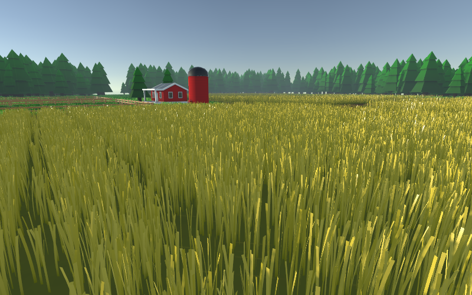
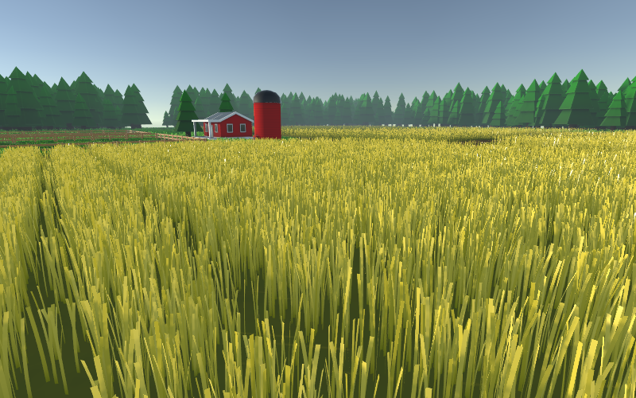

# Visual Settings

Visual settings have minor to no performance impact. They primarily influence the appearance of your material.

## **Grass Floor Color**

These settings can be used to blend the grass into the floor. The mesh filter can automatically set both materials, however, this requires a unique material per mesh, or the different mesh filters will interfere with each other.

## Wind settings

Changes the global wind. If you want to have wind areas or dynamic wind, you should disable global wind and use the interaction system instead.

## Base Textures

Textures that influence the grass material over the whole mesh, can change the color, height, base displacement (for example for crop circles, although using the interaction system instead would be recommended), and grass density.

## Grass types

These settings define the look of each grass type. Check the tooltips for more information on each setting. Most of them are either obvious, like main texture, height, and width, or are equivalent to Unity's PBR materials, like color, specular color, and smoothness.

## **Softness**

The softness setting defines how easy it is to interact with the grass type. A low softness will make the grass stiff and for example sway less in the wind.

## **Subsurface Scattering**

Subsurface scattering is available when the setting [Randomize grass orientation](shader-variants.md#randomize-grass-orientation) is used, however it is not possible when using deferred rendering. Grass that is oriented towards the camera calculates the grass normal as if it was always rotated towards the sun, this results in a beautiful stylized look, however, it is not realistic and can't be used in deferred rendering, where the same normal is used for all lighting calculations. With randomized grass orientation the grass has a front and back side, which can result in a very dark appearance. In reality, the grass is still lit, by light that refracts through the grass itself. The subsurface scattering setting is a very simple approximation of this, with almost no performance cost.



<figure><figcaption></figcaption></figure>



<figure><figcaption>
This picture uses subsurface scattering of about 0.3, which is low enough so the front and back sides are still differently bright. You can use this to fit the grass perfectly into your art style.
</figcaption></figure>



## **Texture atlas settings**

The texture atlas settings are only available when [Use texture atlas](shader-variants.md#use-texture-atlas) is enabled in the _Other Shader Variants_ setting. They tell the shader how many rows and columns are used for this texture type.
