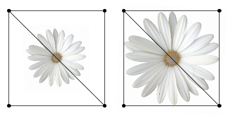
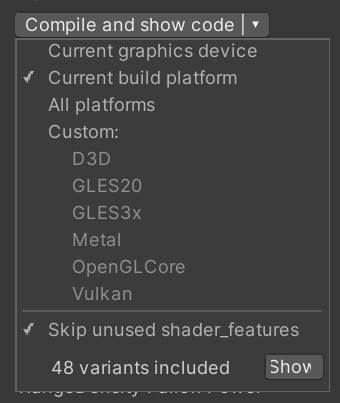
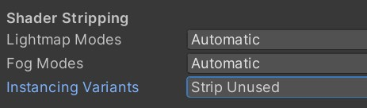

# Performance Optimization

The following optimization areas are ordered by severity, so you shouldn't think about fill rate or pixel shader cost if your scene is full of small lights that could be optimized.

### Reduce Draw Calls

The grass shader works 100% on the GPU, each material draws all blades of grass at once. This is great performance wise, as long as this performance is done as few times as possible. Ideally deferred rendering could be used, where it would only be drawn once per camera and once per shadow caster. However deferred rendering makes it impossible to use different lighting modes or subsurface scattering, so here are a few tips for improving performance in forward rendering:

1. Reduce the number of lights that affect the material. Each light source will cause the grass to be re-rendered. You could set the culling mask of the grass material, to specifically exclude the grass from some lights.
2. Reduce shadow casters. As with lights, each time the grass casts shadows, the whole area will be rerendered. This is also true in deferred rendering. Either disable shadow casting on the material or use as little shadow casters as possible.
3. Reduce shadow cascades. Each shadow cascade causes an additional draw call, so in practice 4 shadow cascades quadruple the performance cost of the shader.
4. If your scene includes many small light sources and you can't use deferred rendering, try to split up your grass area into smaller areas. This will increase the draw calls for directional lights, but it will reduce the amount of grass that will have to be rendered per light source and make the individual draw calls smaller. With some experimentation, this could help improve performance.

### Reduce Geometry

The most performance costly part of the DirectX 11 Grass Shader is generating each blade of grass. While it is still magnitudes faster than on the CPU, the easiest way to improve performance is to simply reduce the polygons. Here are a few rules you should follow:

1. Use the Target Density to set the maximum density, in the closest areas to the camera. If the Target Density is maxed out before you reach your goal, use mesh normalization and subdivision to increase the maximum possible density. Don't set the Target Density higher than your mesh can support, this will lead to unwanted behavior.
2. The 3 other density settings can be used to change the grass falloff. Try to draw as little grass in the distance as possible. High density in the distance consumes more performance, as there is more area to cover. Keep the dense area small and centered around your camera. Use the floor texture to hide the missing grass.
3. Instead of using very small blades of grass, either use an art style that works with wide grass or bundle together multiple smaller blades of grass. You don't have to make billboards, but using a texture to represent 5-10 small blades of grass can work great as a tradeoff between performance and visuals. You can use the texture atlas tool to automatically combine multiple blades of grass.
4. Do not use the Randomized Grass Orientation mode, in this mode each blade of grass must render a front and a back side, doubling the number of triangles. However, you can ignore this tip in case you are using deferred rendering. There the benefit of only having to render the grass once, instead of per light source, likely outweighs the cost of randomizing grass orientations.

### Reduce Fill Rate

The triangles of each blade of grass have to be filled with pixel information on the GPU. This cost is minor compared to the topics above, however, if you are using a high amount of very large billboards, it could become a limitation. Either use a large number of small blades of grass or a smaller amount of large blades of grass.

Also try not to waste any texture space, try to create your textures like the right side, not like the left:

<figure><figcaption><p>The left side is very inefficient, there's a lot of empty space on the texture</p></figcaption></figure>

### Reduce Pixel Shader Cost

Different lighting models and shader features can have different performance costs. You should use the least costly lighting mode that is compatible with your art style. For example, if you don't need specular highlights, you should use the Unshaded lighting mode, if you don't use lights at all, you should use the Unlit lighting mode. Only enable texture atlases if you are actually using them.

This is a last resort of optimization, you should always concentrate on the topics above first, however, you could gain some milliseconds for free if your art style allows it.

### Reduce Shader Compilation Time

### Make sure the shader is not in "Always Included"

There have been cases where a background script automatically moved one of the grass shaders (`Grass.shader`, `Grass Forward Only`, or `Grass URP`) in the "Always Included" list in `Project Settings > Graphics`. When the shader is in there, _all_ variants will be compiled, which can take weeks.

### Skip unused shader features

Make sure the "Skip unsused shader\_feature" is enabled on all variations of the grass shader in your project, e.g. `Grass.shader`, `Grass Forward Only`, or `Grass URP`.

<figure><figcaption></figcaption></figure>

### Strip unused shader instances

Go to `Project Settings > Graphics`, then make sure that instance stripping is enables.

<figure><figcaption></figcaption></figure>

### Use a shader stripping tool

If Unity's shader compiler is still unable to reduce the shader compilation times to acceptable levels, it can be necessary to use an additional shader stripping tool. You can either create one yourself, by following the [blog post by Unity](https://blogs.unity3d.com/2018/05/14/stripping-scriptable-shader-variants/), or use a ready made tool, like the [UnityShaderStripper](https://github.com/SixWays/UnityShaderStripper). For example by following [this guide](https://github.com/SixWays/UnityShaderStripper/wiki#shaderstrippervariantcollection).


I am not a developer of the Shader Stripper tool, so I can't provide support for it. If you have any problems, please contact their developers. If you have tips that may help other developers, please contact me through the contact form and I will share them here!


### Reduce Shader Keywords


With shader keywords, it’s possible to switch between multiple variants of a single, large shader. [More info in the Unity documentation.](http://docs.unity3d.com/Manual/SL-MultipleProgramVariants.html)


While this does not actually affect the performance of the shader, it can change the compile times. In some cases, Unity could even not compile at all, because of too many keywords.

To remove shader keywords, open the Grass.shader file and search for the shader-feature blocks:

```
#pragma shader_feature SIMPLE_GRASS SIMPLE_GRASS_DENSITY THREE_GRASS_TYPES FOUR_GRASS_TYPES
#pragma shader_feature __ PBR_GRASS_LIGHTING
#pragma shader_feature __ UNIFORM_DENSITY
#pragma shader_feature __ NO_TESSELLATION_SMOOTHING
```

If you want to remove a keyword, replace the shader\_feature line like this:

```
#define SIMPLE_GRASS
#define PBR_GRASS_LIGHTING
#define UNIFORM_DENSITY
//NO_TESSELLATION_SMOOTHING is not defined
```

You can replace one, or multiple lines, but they have to be identical in every shader\_feature block in the shader. " \_\_ " is an empty keyword, which can be used to switch a single feature on or off. If you want to disable a keyword using it, just don’t create a #define line, like shown with the NO\_TESSELLATION\_SMOOTHING keyword above.

There are multiple shader feature blocks per shader file, make sure all of them are identical.
